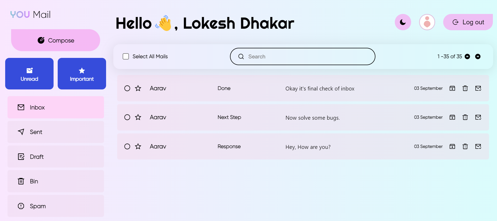

<h1 align="center" id="title">You Mail</h1>

<h2>Project Screenshots:</h2>

  
 <h2>💻 Built with</h2>

Technologies used in the project:

*   HTML
*   CSS
*   JavaScript
*   NodeJS
*   ExpressJS
*   MongoDB
*   Ajax